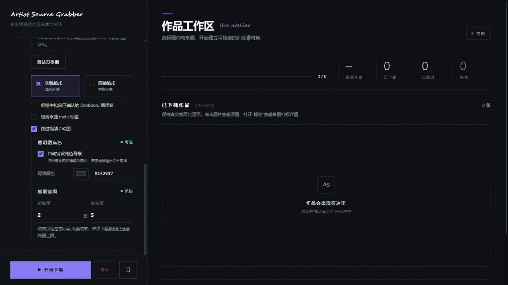
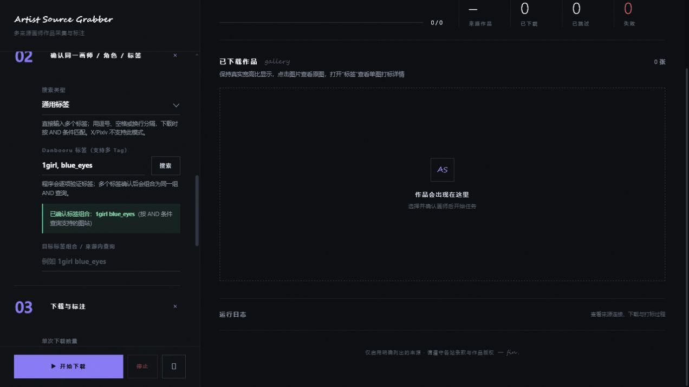
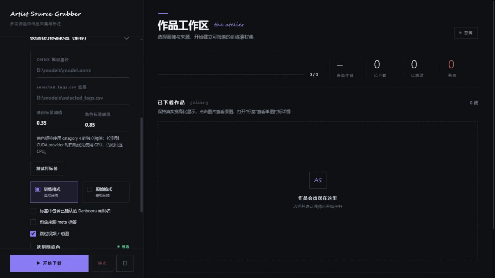

<p align="center">
  
</p>

<h1 align="center">Artist Source Grabber V2</h1>

<p align="center">多来源画师、角色与标签素材采集 · 本地 WebUI · 可选图像打标</p>

<p align="center">
  <a href="https://github.com/salmantais961-boop/ArtistSourceGrabber"></a>
  <a href="https://github.com/salmantais961-boop/ArtistSourceGrabber/releases"></a>
  <a href="https://github.com/salmantais961-boop/ArtistSourceGrabber/blob/main/requirements.txt"></a>
  <a href="https://github.com/salmantais961-boop/ArtistSourceGrabber/commits/main"></a>
</p>

一个面向画师作品整理、来源交叉确认与图像标签生成的本地 WebUI 工具。

它以 Danbooru 画师实体为身份锚点，尝试从名称、别名和公开主页 URL 中确认同一画师，再从 X、Pixiv、Danbooru、Gelbooru、Safebooru、Konachan、yande.re、Openverse 等来源下载作品，并为图片生成适合数据整理或训练前处理的同名 `.txt` 标签。

> [!NOTE]
> 特别感谢 [buxinzi2233](https://github.com/buxinzi2233) 在 [贡献 Fork](https://github.com/buxinzi2233/ArtistSourceGrabber) 中实现并维护 Linux 兼容、角色/标签搜索与前端搜索类型增强。本项目已在保留原有行为的基础上合并这些改进，并继续完善跨平台兼容性。

> [!IMPORTANT]
> 本项目是纯 **VIBE Coding / AI 辅助编程产物**。设计、代码重构、调试、测试与文档主要通过自然语言驱动 AI 完成，并经过有限的人工运行验证。它不是经过专业安全审计、法律审查或长期生产验证的软件。使用前请自行检查源码，并只在能够承担数据、账号和法律风险的环境中运行。

## 致谢

感谢 [buxinzi2233](https://github.com/buxinzi2233) 的跨平台与角色/标签搜索贡献，也感谢 [linux.do](https://linux.do/) 社区提供的交流平台与支持。

## 快速导航

[界面预览](#界面预览) · [功能概览](#v2-功能概览) · [安装](#安装方法) · [基本使用](#基本使用流程) · [打标设置](#图像打标) · [隐私与风险](#凭据与隐私)

## 界面预览

<table>
  <tr>
    <td width="50%"></td>
    <td width="50%"></td>
  </tr>
  <tr>
    <td align="center"><sub>配置轨道：来源、打标、透明图底色与抓取范围</sub></td>
    <td align="center"><sub>搜索模式：画师 / 角色 / 多 Tag AND 条件</sub></td>
  </tr>
  <tr>
    <td width="50%"></td>
    <td width="50%"></td>
  </tr>
  <tr>
    <td align="center"><sub>本地 WD14：通用 / 角色双阈值与 CUDA 自动优先</sub></td>
    <td align="center"><sub>作品工作区：真实宽高比瀑布流、来源状态与原图预览</sub></td>
  </tr>
</table>

截图仅用于展示界面布局。截图中的作品、账号名、标签和站点信息不代表项目方拥有、授权或推荐使用相关内容。

## V2 功能概览

- 以 Danbooru 画师记录作为身份锚点，支持画师名、别名与主页 URL 的模糊搜索。
- **新增：角色/标签搜索模式。** 切换搜索类型为「角色」或「通用标签」，直接输入角色名（如 `hatsune_miku`）或标签（如 `1girl`）搜索 Danbooru 标签库，支持 booru 站点批量下载。X/Pixiv 在非画师模式下自动禁用。
- **新增：多 Tag AND 搜索。** 以逗号、空格或换行分隔多个标签（如 `1girl, blue_eyes, solo`），在支持 tag 查询的图站中作为同一组条件抓取。
- 自动读取 Danbooru 画师记录中登记的 X、Pixiv 等公开主页信息。
- 支持多来源混合任务，单个来源失败不会中断其他来源。
- X 与 Pixiv 使用相互隔离的专用 Chrome Profile，登录状态可持久保存。
- 登录窗口关闭后不会长期保留可见浏览器；抓取时按需短暂启动后台浏览器并自动退出。
- 下载结果统一保存到同一画师目录，并在文件名前添加来源前缀。
- 使用 SHA-256 跨来源去重；重复图片会合并标签而不是重复保存。
- 图片按真实宽高比瀑布流展示，不强制裁切为正方形。
- 支持原图 Lightbox 预览以及逐图查看来源标签、模型标签和最终写入标签。
- 支持来源原生标签、OpenAI-compatible 视觉 LLM 和本地 WD14 ONNX 三类标注方式。
- 支持“仅打标器标签”“来源标签 + 打标器标签”“仅来源标签”三种合并策略。
- LLM 使用证据优先的结构化提示词，支持严格 JSON Schema、JSON Object 和普通响应自动降级，并包含宽松 JSON 解析与错误脱敏。
- WD14 支持通用标签阈值与角色标签阈值分开设置；检测到 CUDA 时自动优先 GPU，否则安全回退 CPU。
- 支持起始页 / 结束页抓取范围限制，下载数量仍作为最终硬上限。
- 透明图片可选自动铺设用户指定的纯色底，并在作品卡片上标记处理状态。
- 服务只监听本机回环地址 `127.0.0.1`。

## 下载与完整性

请从 GitHub Releases 下载最新的 V2.1.0 压缩包：

```text
ArtistSourceGrabber-V2.1.0.zip
```

请以对应 GitHub Release 页面列出的 SHA-256 为准，不要从不明网盘、群文件转存或第三方镜像下载带有登录功能的修改版。

## 系统要求

- **Windows:** Windows 10 或 Windows 11，64 位。
- **Linux:** 主流发行版（Ubuntu/Debian/Arch 等），64 位。X/Pixiv 的浏览器登录功能需要安装 Chrome/Chromium。
- 建议至少 8 GB 内存；使用大型 ONNX 模型时建议 16 GB 或更多。
- 足够的磁盘空间。原图下载、浏览器 Profile、模型文件和缓存可能快速占用数 GB。
- Google Chrome（推荐）或 Chromium。X 与 Pixiv 的推荐登录方式依赖专用 Chrome Profile。
- Python 3.11 及以上版本，64 位。
- 能够访问所选来源的正常网络环境。

本项目不需要 Node.js、数据库、ffmpeg 或 OpenAI Python SDK。

## 安装方法

### 方法一：一键安装，推荐

1. 下载 V2 ZIP，并完整解压到普通目录。
2. 不要直接在压缩软件预览窗口中运行脚本。
3. 双击 `先运行这个.bat`。
4. 脚本会创建项目独立环境 `.venv`，并安装：
   - `gallery-dl`；
   - `websocket-client`；
   - `numpy`；
   - `Pillow`；
   - `onnxruntime`；
   - pip、setuptools、wheel。
5. 如果系统缺少 Python、Chrome 或 Microsoft Visual C++ 运行库，脚本会尝试通过 `winget` 安装。
6. 安装完成后双击 `start.bat`。
7. 浏览器会打开 `http://127.0.0.1:8710/`。

建议安装到类似路径：

```text
D:\Tools\ArtistSourceGrabber
```

避免安装到需要管理员权限的系统目录，也不要把项目放在会自动同步 Cookie、模型或下载内容的公共网盘目录中。

### 方法二：Windows 手动安装

```powershell
python -m venv .venv
.\.venv\Scripts\python.exe -m pip install --upgrade pip setuptools wheel
.\.venv\Scripts\python.exe -m pip install -r requirements-all.txt
.\.venv\Scripts\python.exe app.py
```

只需要基础抓图功能、不使用本地 ONNX 时，可以安装：

```powershell
python -m pip install -r requirements.txt
```

### 方法三：Linux 安装

```bash
git clone https://github.com/salmantais961-boop/ArtistSourceGrabber.git
cd ArtistSourceGrabber
python3 -m venv .venv
.venv/bin/pip install -r requirements-all.txt
bash start.sh
```

如果只使用 booru 站点（Danbooru/Gelbooru/Konachan 等）而不需要 X/Pixiv，可以只安装基础依赖：

```bash
.venv/bin/pip install -r requirements.txt
bash start.sh
```

浏览器 Profile 在 Linux 下保存在 `~/.local/share/DanbooruGrabber/`。

## 基本使用流程

1. 在“混合来源”中勾选需要执行的来源。
2. 选择搜索类型（画师 / 角色 / 通用标签）。角色/标签模式下 X 和 Pixiv 会自动禁用。
3. 输入 Danbooru 画师名、角色名、多个标签或已知的 X 主页 URL。多标签可用逗号、空格或换行分隔。
4. 点击搜索并人工确认候选；多 Tag 模式会逐项验证后生成一个 AND 组合查询。
5. 检查自动带出的 X handle、Pixiv 数字用户 ID 和各来源标签。
6. 对 X 或 Pixiv，首次使用时打开专用登录窗口并自行完成登录。
7. 选择下载数量、页码范围、内容分级、透明图底色、标签格式和打标器。
8. 先使用“测试来源连接”和“测试打标器”。
9. 确认结果正常后开始下载。
10. 在作品工作区查看原图、来源状态和每张图片的打标详情。

URL 精确关联通常比同名猜测可靠，但任何自动匹配都可能出错。批量下载前应人工核对候选画师、主页链接和作品风格。

## 已启用来源

| 来源 | 实现方式 | 认证说明 |
| --- | --- | --- |
| X / Twitter | `gallery-dl`，失败时可能使用有限回退逻辑 | 推荐专用 Chrome 登录；兼容手填 Cookie、cookies.txt 或浏览器 Cookie |
| Pixiv | 网页 API / App API | 推荐专用 Chrome 登录；兼容 access token 或 PHPSESSID；部分公开作品可匿名访问 |
| Danbooru | 官方公开 API | 匿名可用；用户名与 API Key 可选 |
| Gelbooru | DAPI | 当前通常需要 User ID 与 API Key |
| Safebooru.org | DAPI | 通常可匿名访问 |
| Konachan | Moebooru API | 通常可匿名访问 |
| yande.re | Moebooru API | 通常可匿名访问 |
| Openverse | 开放许可聚合 API | 匿名访问；必须再次核验具体作品许可证 |

站点接口、登录流程和反自动化策略随时可能变化。某个来源今天可用，不代表未来仍然可用，也不代表这种访问方式获得站点许可。

## X 与 Pixiv 登录机制

推荐模式不会直接读取日常 Chrome Profile，而是分别使用：

- **Windows:** `%LOCALAPPDATA%\DanbooruGrabber\XBrowserProfile` / `PixivBrowserProfile`
- **Linux:** `~/.local/share/DanbooruGrabber/XBrowserProfile` / `PixivBrowserProfile`

两个 Profile 相互隔离，也与日常 Chrome Profile 分离。

登录流程：

1. 点击“打开登录 / 切换账号”。
2. 在专用 Chrome 窗口中自行登录。
3. 返回 WebUI 点击“检查登录”。
4. 检测成功后登录窗口会关闭。
5. 抓取时程序按需短暂启动后台浏览器读取会话，并在读取后退出。

Chrome 会使用 Windows 和自身机制加密保存 Profile 中的 Cookie。项目不会把这些 Cookie 返回前端，也不会写入浏览器 `localStorage`。但只要本机账号、浏览器 Profile 或运行中的进程被攻击者控制，登录会话仍可能泄露。

## X / Pixiv 封号和限制风险

> [!CAUTION]
> 使用非官方工具访问 X 或 Pixiv 可能触发验证码、临时限制、强制退出、Cookie 失效、IP 限速、设备风控、功能限制或永久封禁。即使控制速度、使用浏览器登录或只下载公开作品，也不能保证账号安全。

风险可能来自：

- 短时间请求大量作品或翻页；
- 多任务并发访问同一站点；
- 长时间持续运行；
- 频繁切换 IP、代理、User-Agent 或设备环境；
- Cookie 在多个工具、机器或位置同时使用；
- 访问年龄限制、登录限制或仅关注者可见内容；
- 接口行为与正常网页用户明显不同；
- 站点临时加强反爬、验证码或风控策略；
- 使用已经处于异常状态、刚注册或频繁改密的账号。

### 风险降低建议

- 第一次只抓取 1 至 5 张，确认请求和文件结果正常。
- 逐步增加数量，不要一开始就设置为无限抓取。
- 不要同时运行多个实例抓取同一来源。
- 遇到 401、403、429、验证码、登录失效或异常页面时立即停止，不要循环重试。
- 不要使用本工具绕过付费、关注者限定、地域、年龄或访问控制。
- 不要尝试绕过封禁、限流、验证码或站点技术保护措施。
- 不要把 `auth_token`、`ct0`、`PHPSESSID`、cookies.txt 或浏览器 Profile 发给他人。
- 使用强且唯一的密码，并启用站点提供的双重验证。
- 定期检查账号登录记录；不再使用时从站点后台撤销会话或修改密码。

### 关于“小号”的建议

如果你决定测试登录抓取，并且平台规则允许，可以使用一个不承载重要私信、付费内容、创作资产或主要社交关系的非关键账号，以降低意外封禁造成的损失。

这不是“零风险方案”，也不是规避平台处罚的建议：

- 小号同样可能被限制或永久封禁；
- 同设备、同 IP、同支付信息或其他关联信号可能影响其他账号；
- 不要创建或轮换账号来绕过已经实施的封禁、限流或执法措施；
- 不要违反平台关于多账号、自动化、抓取或访问控制的规定；
- 不要在测试账号中保存无法替代的数据或使用与主账号相同的密码；
- 不要购买、租用或共享来源不明的账号与 Cookie。

如果你的主账号具有商业价值、长期历史、创作者身份、重要私信或付费权益，最保守的选择是不要让该账号参与任何非官方自动化工具。

## 图像打标

### 来源标签

直接使用站点返回的标签。不同来源的标签语言、粒度和准确性差异很大，也可能包含错误、冒犯性描述或不适合训练的数据。

### OpenAI-compatible 视觉 LLM

填写：

- Base URL；
- API Key，本地无鉴权服务可留空；
- 支持图像输入的模型名；
- 提示词预设或自定义提示词。

内置提示词按“可见证据优先”组织：先检查主体、外观、服装、动作、构图、环境和媒介，再输出去重后的 Danbooru / WD14 风格 JSON 标签。它会要求模型省略不确定属性、互相冲突的标签和仅凭画风猜测的画师名；来源角色/版权提示只作为需要视觉复核的参考。

远程 LLM Endpoint 会收到图片内容。不要把私人、未公开、受保密协议约束、包含个人敏感信息或没有上传授权的图片发送给第三方模型服务。模型供应商的日志、保留期和训练政策由供应商控制。

### 本地 WD14 ONNX

需要：

- `.onnx` 模型文件；
- 对应的 `selected_tags.csv`；
- `onnxruntime`、Pillow、numpy。

阈值可分开设置：

- **通用标签阈值**：默认 `0.35`，用于 category 0 以及其他非角色标签；
- **角色标签阈值**：默认 `0.85`，用于 `selected_tags.csv` 中 category 4 的角色名；
- 安装 `onnxruntime-gpu` 且 CUDA provider 可用时会自动优先 GPU，否则回退 CPU。

模型和标签文件需要用户自行获取。本项目不自动提供模型权重。下载和使用模型前应检查模型卡、许可证、训练数据说明和商业使用限制。

### 透明图片纯色底

启用“自动铺设纯色背景”后，程序只处理实际含透明像素的 PNG、WebP、GIF 等图片。颜色支持取色器和 `#RRGGBB` 精确输入；转换在 SHA-256 去重和打标之前完成，因此保存文件、预览和打标器看到的是同一张已铺底图片。未含透明像素的图片不会重新编码。

### 抓取范围

“起始页 / 结束页”限制来源 API 的翻页范围，结束页留空表示继续到来源结束；“单次下载数量”仍是最终硬上限。不同站点每页数量不同，因此页范围更适合分批续抓，不代表固定作品数。

## 文件输出

默认保存结构：

```text
downloads/
└─ <Danbooru 画师名>/
   ├─ twitter__x_123456_0.jpg
   ├─ twitter__x_123456_0.txt
   ├─ pixiv__pixiv_12345_67890_p0.jpg
   └─ pixiv__pixiv_12345_67890_p0.txt
```

重复图片通过 SHA-256 检测。跨来源出现相同文件时，程序保留一份图片，并按照当前标签策略合并或覆盖对应 `.txt`。

## 凭据与隐私

- Web 服务只监听 `127.0.0.1`，不要自行改为公网监听，除非你理解认证、CSRF、目录暴露和远程代码风险。
- X、Pixiv、Danbooru、Gelbooru 和 LLM Key 不写入前端 `localStorage`。
- 专用 Chrome Profile 会保存在当前 Windows 用户的 `%LOCALAPPDATA%` 中。
- 临时 cookies.txt 只用于当前抓取调用，退出时会尝试覆盖并删除。
- 异常关机、杀毒软件锁文件或进程崩溃可能导致临时文件残留，应定期检查系统临时目录。
- 下载目录可能包含版权作品、成人内容、作品元数据和模型生成标签，请自行保护、备份或安全删除。
- 日志经过一定程度的脱敏，但不能保证第三方库的所有异常文本都不包含敏感信息。公开日志前必须人工检查。
- 不要把整个 `%LOCALAPPDATA%\DanbooruGrabber`、`.venv`、downloads 或浏览器 Profile 打包分享。

## 版权、许可证与数据集使用

“可以在网页或 API 中访问”不等于获得以下权利：

- 下载或批量复制权；
- 再分发权；
- 建立公开数据集的权利；
- 商业使用权；
- 训练生成式模型的权利；
- 删除署名、水印或来源信息的权利；
- 创作或发布衍生作品的权利。

作品版权通常属于原作者或其他权利人。用户必须逐项确认来源站点条款、作品许可证、作者声明、当地法律以及预期用途是否允许下载、保存、研究、训练、再分发或商业使用。

Openverse 等聚合服务展示的许可证信息也可能过期、错误或缺少上下文。应回到原始作品页面进行二次核验并保留许可证证据。

对于删除、撤回授权或明确表示不希望作品用于 AI 训练的作者，应尊重其选择并停止使用相关数据。

## 成人内容与当地法律

部分来源可能包含成人、暴力或其他敏感内容。用户必须：

- 达到所在地区和来源站点要求的法定年龄；
- 遵守内容分级、未成年人保护和数据持有法律；
- 不下载、保存、处理或传播任何违法内容；
- 不使用工具规避年龄验证或内容访问限制；
- 在共享设备上采取访问控制，避免敏感内容暴露给未成年人或无关人员。

如果发现疑似违法内容，应立即停止任务，不要传播文件，并按照当地法律和平台流程处理。

## 完整免责声明

本项目与 X Corp.、Twitter、Pixiv Inc.、Danbooru、Gelbooru、Safebooru、Konachan、yande.re、Openverse、OpenAI 及任何作品作者、模型作者或站点运营方没有隶属、授权、认可或合作关系。

本软件按“原样”和“可用状态”提供，不作任何明示或默示保证，包括但不限于：可用性、稳定性、准确性、适销性、特定用途适用性、不侵权、账号安全、数据完整性、标签正确性、站点兼容性和法律合规性。

使用者自行承担全部风险，包括但不限于：

- 账号警告、限制、验证码、暂停或永久封禁；
- Cookie、Token、API Key 或浏览器 Profile 泄露；
- IP、设备或关联账号被风控；
- 下载错误画师、错误作品、重复作品或不完整文件；
- 标签错误、偏见、冒犯性输出或模型幻觉；
- 文件覆盖、磁盘占满、性能下降或数据丢失；
- 违反站点服务条款、机器人规则、API 条款或访问控制；
- 侵犯版权、隐私权、肖像权、数据库权或其他权利；
- 因远程 LLM、代理、第三方库、模型或网站变化导致的安全和隐私问题。

在适用法律允许的最大范围内，项目作者、贡献者、AI 工具提供方和分发者不对任何直接、间接、附带、特殊、惩罚性或后果性损失承担责任。

本 README 不构成法律意见、安全保证或平台合规认证。涉及商业使用、公开数据集、模型训练、敏感内容或大规模抓取时，应咨询具备相应资格的法律和安全专业人士。

## 常见问题

### `start.bat` 打不开

先运行 `先运行这个.bat`，确保 `.venv\Scripts\python.exe` 已创建。不要从 ZIP 内直接运行。

### 页面显示 Not Found

确认后台窗口仍在运行，并访问终端显示的实际地址。默认从 `http://127.0.0.1:8710/` 开始，端口被占用时可能选择后续端口。

### X / Pixiv 登录后仍显示未登录

- 确认是在项目打开的专用 Chrome 窗口中登录；
- 登录完成后等待页面稳定，再点击“检查登录”；
- 不要同时让多个项目实例使用同一个专用 Profile；
- 若站点要求验证码，请在可见窗口中自行完成；
- 不要把日常 Chrome Profile 手动复制到项目目录。

### X 返回 401、403、429 或 Cookie 失效

立即停止任务。不要高频重试。稍后在正常浏览器中确认账号状态，并检查站点是否要求重新登录、验证码或安全验证。

### ONNX 报 DLL 加载错误

确认使用 64 位 Python 3.11+，并安装 Microsoft Visual C++ 2015-2022 Redistributable x64。然后重新运行 `先运行这个.bat`。

### Linux 下 `start.sh` 报错

确认已创建 `.venv` 并安装依赖。确保脚本有执行权限：`chmod +x start.sh`。

### LLM 提示“未返回合法 JSON”

确认模型支持图片输入。尝试内置提示词、降低自定义指令复杂度，并检查兼容服务是否正确返回 OpenAI 风格响应。

### 图片能下载但标签不符合预期

在单图“打标详情”中检查来源标签、打标器标签、最终标签和合并策略。不同来源的原生标签不会自动具有一致语义。

## 项目结构

```text
ArtistSourceGrabber/
├─ app.py                     本地 HTTP 服务与任务调度
├─ image_processing.py        透明图片纯色底处理
├─ http_util.py               HTTP、代理与错误处理
├─ sources/                   各图片来源与浏览器会话
├─ tagging/                   LLM 与 ONNX 打标器
├─ static/                    原生 HTML / CSS / JavaScript WebUI
├─ tests/                     自动化测试
├─ requirements.txt           基础依赖
├─ requirements-all.txt       包含 ONNX 的完整依赖
├─ 先运行这个.bat              一键依赖安装（Windows）
├─ start.bat                  启动程序（Windows）
└─ start.sh                   启动程序（Linux）
```

## 开发与验证

```bash
python -m compileall -q app.py image_processing.py http_util.py sources tagging
python -m unittest discover -s tagging -p "test_*.py" -q
python -m unittest discover -s tests -p "test_*.py" -q
python app.py --no-browser
```

## V2 说明

V2 重点改进：

- 现代简约深色 WebUI；
- 更合理的配置轨道和作品工作区；
- 原始宽高比瀑布流；
- 原图预览；
- 单图打标详情；
- X / Pixiv 专用登录 Profile 持久化；
- 浏览器进程按需启动并清理；
- 多来源统一目录和去重；
- LLM JSON 容错与预设提示词；
- ONNX 与来源标签合并策略修复；
- 一键安装完整依赖。

### V2.x 追加

- Linux 浏览器发现路径、Profile 目录、进程管理与启动脚本适配；
- 画师 / 角色 / 标签三种搜索模式与多 Tag AND 查询；
- 透明图片自动铺设自选纯色底；
- 抓取起止页范围限制；
- 更严格的 LLM 证据优先提示词；
- WD14 通用阈值、角色阈值与 CUDA/CPU 自动 provider 选择。

## 开源许可状态

除非仓库根目录另外提供明确的 `LICENSE` 文件，否则公开源代码不自动授予复制、修改、再分发或商业使用许可。第三方依赖、网站内容、模型权重和下载作品分别受其自己的许可证与条款约束。

如果未来添加开源许可证，该许可证也只覆盖本项目原创代码，不覆盖下载作品、站点数据、商标、第三方模型或第三方依赖。

## 最后提醒

请把它当成需要人工监督的实验性本地工具，而不是“安全、合法、永不封号”的官方客户端。低频、小规模、可停止、可审计，并且尊重作者、站点规则和访问限制，是最基本的使用前提。
